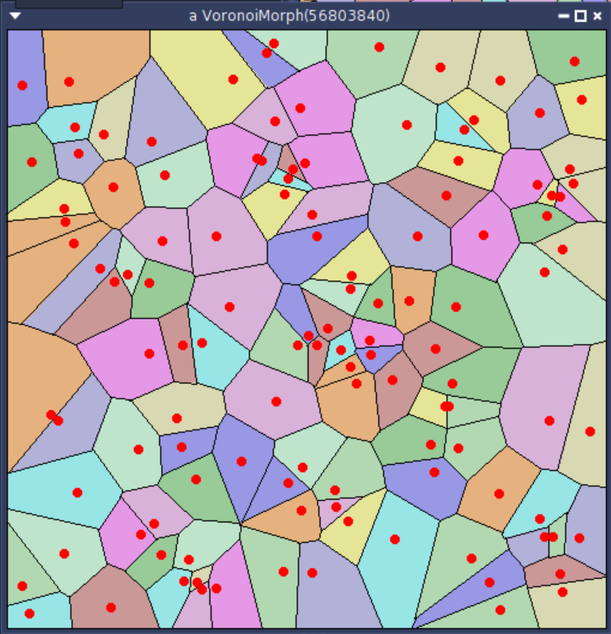

An implementation of Voronoi Diagram for Pharo



GUI include morphic and Bloc

```st
Metacello new
	baseline: 'Voronoi';
	repository: 'github://rvillemeur/VoronoiDiagram:main/src';
	onConflictUseIncoming;
	load
```

And then, choose either `VoronoiBloc openDefault` or `VoronoiMorph openDefault`
